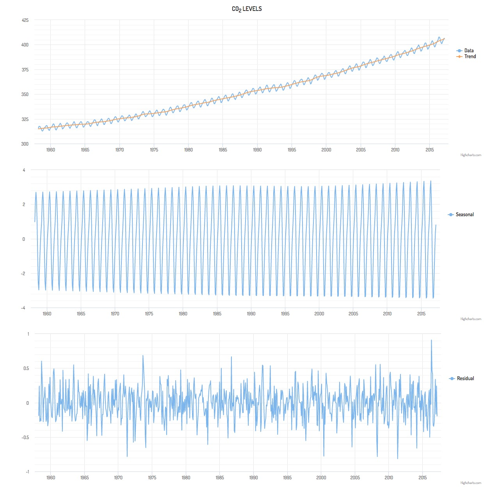

# stl-decomp-4j

stl-decomp-4j implements the seasonal-trend decomposition algorithm described in [STL: A Seasonal-Trend Decomposition Procedure Based on Loess](http://www.wessa.net/download/stl.pdf). This is a Java port of the original Ratfor/Fortran available from [Netlib](http://netlib.org) ([original source here](http://netlib.org/a/stl)), with an extension to support local quadratic interpolation (in addition to the standard flat and linear local interpolation).

As with the original Fortran version, this version of the STL algorithm expects equally spaced data with no missing values.

## Example

```
double[] values; // ...

SeasonalTrendLoess smoother = stlBuilder.
    setPeriodLength(12).
    setSeasonalWidth(35).
    setNonRobust().
    buildSmoother(values);

SeasonalTrendLoess.Decomposition stl = smoother.decompose();
```

The `examples/StlDemoRestServer` directory includes a copy of the [Monthly CO_2 Measurement Data](http://www.esrl.noaa.gov/gmd/ccgg/trends/) and a simple REST server that reads this data, performs an STL decomposition on the data, and serves up the results to `http://localhost:4567/stldemo`. The `examples/StlDemoRestServer/index.html` file loads the data from this server and plots the resulting decomposition.


